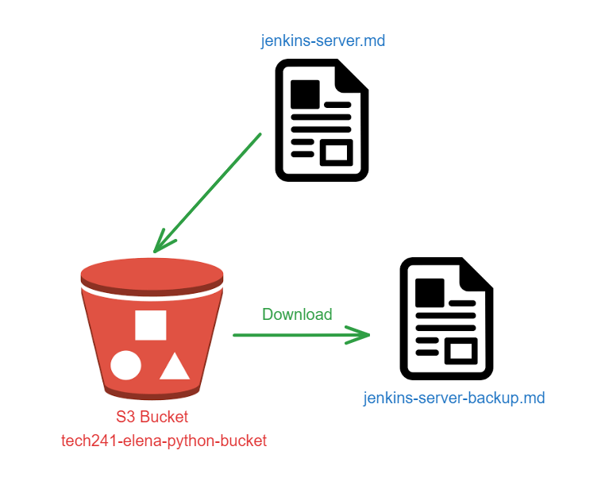

# Distaster Recovery on Amazon Web Services (AWS)

Disaster recovery primarily focuses on safeguarding data by migrating it to the cloud instead of relying solely on local storage. The reason behind this approach is to ensure that even if a particular region where the data is housed faces a compromise, the data remains recoverable. By leveraging cloud infrastructure, organizations gain resilience and the ability to restore critical information, protecting against unforeseen disasters or regional disruptions.

## Simple Storage Service (S3) 

S3 is a service provided by AWS as a way to store data in the cloud. It uses buckets and each bucket has a unique name, and you can create multiple buckets in your AWS account to organize and manage your data effectively. 

These can keep various types of files, such as documents, images, videos, and backups. They cannot hold virtual machines or amazon machine images (AMIs). 

Some benefits of S3 buckets are:

1. **Unlimited Storage**: S3 buckets offer virtually unlimited storage space, so you can store a vast amount of data without worrying about running out of space.

2. **Accessible from Anywhere**: You can access the files in your S3 bucket from anywhere with an internet connection. It provides a reliable and scalable way to share data globally.

3. **Highly Durable and Available**: AWS ensures high durability and availability for S3 data. Your files are redundantly stored across multiple servers and data centers, reducing the risk of data loss.

4. **Security and Access Control**: You can control who can access your S3 bucket and its contents. AWS provides various security features, such as access policies, encryption, and identity management, to protect your data.

5. **Integration with Other AWS Services**: S3 integrates seamlessly with other AWS services, allowing you to use it as a data source for applications, websites, analytics, and more.

6. **Scalability**: S3 automatically scales to handle a large number of simultaneous requests, ensuring fast and efficient data access.

7. **Pay-as-You-Go**: With S3, you only pay for the storage you use and the data transfer, making it cost-effective and scalable for businesses of all sizes.

## My Demo

Using three Python scripts I will be creating an S3 bucket, adding a file and then downloading it: 

The first step was to install the AWS command line interface on pycharm using pip.

`pip install awscli`

Then using the command `aws configure` I logged in with my AWS details. I could then use aws commands such as `aws s3 ls` which displays all of the buckets.

The scripts use a Python library called Boto3. It is like a helper which can speak the language of AWS. Boto3 simplifies the process of working with AWS services, so you can integrate them into your applications, build automated workflows, and manage cloud resources efficiently using Python code.